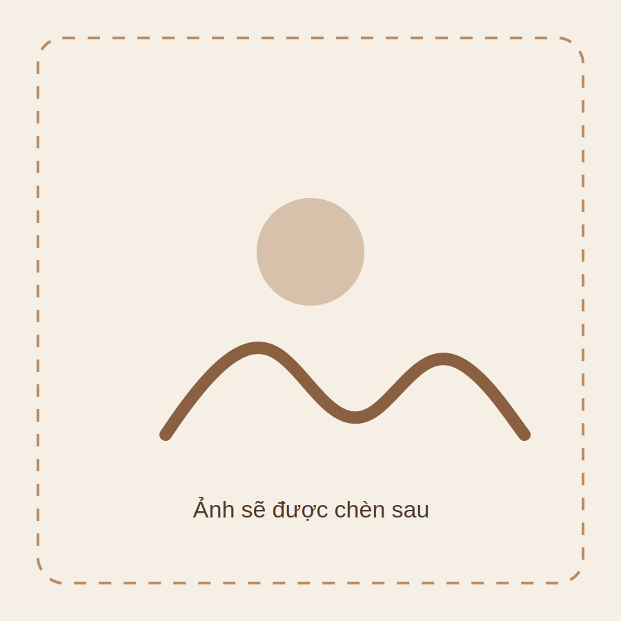

# Catch Up Coffee Static Website

Cấu trúc:
- `index.html`: trang chính
- `lost-found.html`: Lost & Found
- `about.html`: placeholder About Us
- `recruitment.html`: placeholder Tuyển dụng
- `assets/css/style.css`: giao diện
- `assets/js/main.js`: menu mobile
- `assets/images/logo-catch-up.png`: logo
- `assets/images/placeholder.svg`: ảnh tạm

## Cách thay ảnh
Trong file HTML, tìm dòng dạng:
```html

```
Thay `src` thành ảnh thật, ví dụ:
```html

```
Sau đó bỏ ảnh thật vào thư mục `assets/images/`.

## Cách thay giá
Tìm `Giá đang cập nhật` rồi đổi thành giá thật, ví dụ `55k`.

## Cách chạy thử
Mở trực tiếp file `index.html` bằng trình duyệt, hoặc kéo cả thư mục lên VS Code rồi dùng Live Server.
